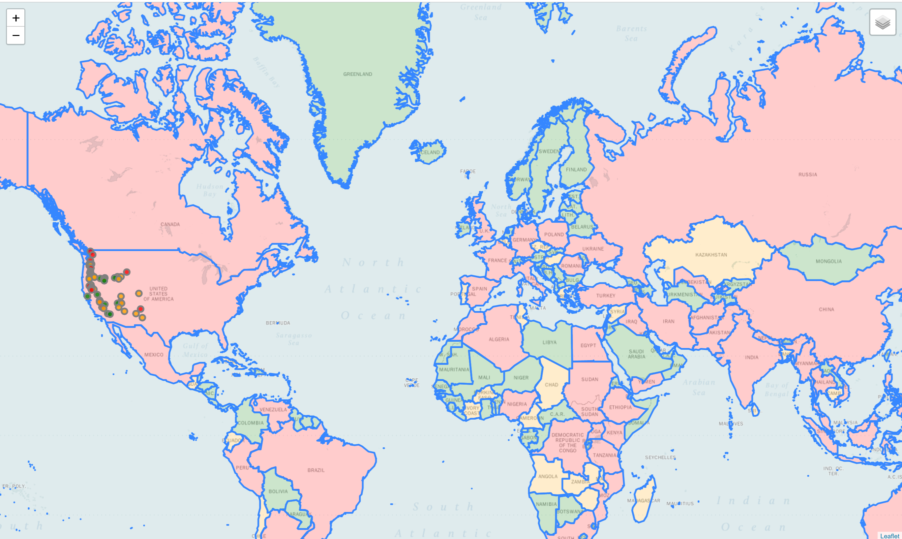
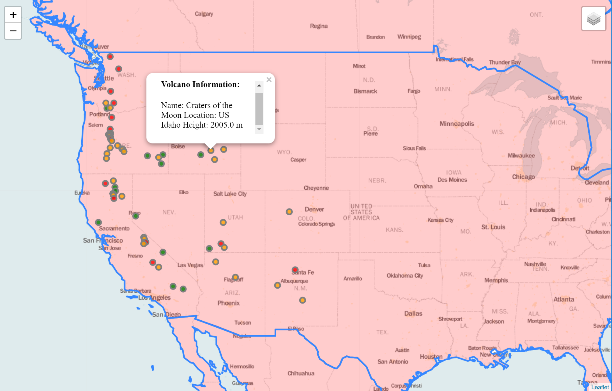

# A series of Python Projects

## Project 1 - Population and Volcanoe Map
  
  + ## Languages
  + Python with Folium and Panda Libraries 
  + HTML Generated from python

  ### Mapping Project that allows you to see all of the volcanoes in the United States and are colored by elevation
  ### By clicking on a dot you can see more information about the volcanoe such as elevation, location, and it's name
  ### The countries are also colored by population
  
  
  
  ## Project 2 - Website Blocker
    + ## Languages
    + Python
    
    ### A simple python program that blocks websites between certain hours of the day anytime my computer starts
    ### You can add as many or as few websites as you want
    ### This way is effective because you don't have to rely on anyone turning it on, it just is on when it
    ### is working hours, and when it's not you have access to all the websites you want
  
  
  
